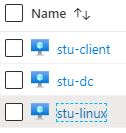

# Applied Purple Teaming Threat Optics Lab - Azure TerraForm 
Purple Teaming Attack &amp; Hunt Lab - TerraForm

<!-- Start Document Outline -->

* [Background](#background)
* [Installation:](#installation)
	* [Install AzureCLI](#install-azurecli)
	* [Install TerraForm](#install-terraform)
* [Setup and Configuration](#setup-and-configuration)
	* [Create Token/Document](#create-tokendocument)
	* [Configure Regions](#configure-regions)
	* [Clone APT TerraForm Repository](#clone-apt-terraform-repository)
	* [Execute TerraForm build process](#execute-terraform-build-process)
	* [Source IP Filtering](#source-ip-filtering)
* [Modules](#modules)
	* [Network](#network)
	* [Active Directory](#active-directory)
	* [Linux / Helk](#linux--helk)
	* [Windows Client](#windows-client)
	* [Hat-Tips and Acknowledgments](#hat-tips-and-acknowledgments)

<!-- End Document Outline -->

---
## Background
Defensive Origins uses a highly verbose threat optics lab to isolate adversarial techniques to more easily attribute IOC (indicators of compromise).  These labs have routinely been time consuming to build and manage.  The platform included here automates much of the threat-optic lab environment built on the Azure cloud network.

## Installation:

This process requires Python3.

### Install AzureCLI
https://docs.microsoft.com/en-us/cli/azure/install-azure-cli-apt?view=azure-cli-latest

### Install TerraForm
https://learn.hashicorp.com/terraform/getting-started/install.html

# Setup and Configuration

## Create Token/Document
* https://www.terraform.io/docs/providers/azurerm/guides/service_principal_client_secret.html
* Edit LabBuilder.py and add in your Token info at the top of the file. 

## Default Credentials:
Default credentials are set in LabBuilder.py.
* Windows & Linux systems:
```bash
itadmin:APTClass!
```
* Kibana:
```bash 
helk:hunting
```

### Changing Default Credentials
The credentials can be changed within the locals variable:
``` bash  
locals {
  resource_group_name   = "class-resources"
  master_admin_username ="itadmin"
  master_admin_password ="APTClass!"
  master_domain         ="labs.local"
}
```

The password for Kibana can be changed by editing the HELK install line:
```bash
./helk_install.sh -p hunting -i 10.10.98.20 -b 'helk-kibana-analysis-alert'
```
within the
```bash
3-setup.tf`
```
This file is located at:

```bash
APT-Lab-Terraform/master/modules/linux/3-setup.tf
```

Please note the following regarding access:
* Only the Windows client is accessible externally
* Kibana is accessed internally, use a browser on one of the Windows machines to access.
* An SSH client will need to be installed on the Windows machines in order to SSH to the Linux system.


## Configure Regions
* You can also update the Region variable to desired region. This is updated LabBuilder.py.
* List of regions can be found here that offer the B-series we use in this lab environment.
* https://azure.microsoft.com/en-us/global-infrastructure/services/?products=virtual-machines

## Clone APT TerraForm Repository

```bash
git clone https://github.com/DefensiveOrigins/APT-Lab-Terraform.git
cd APT-Lab-Terraform
```

## Execute TerraForm build process
Run the builder and deploy your systems.

```bash
python .\LabBuilder.py -m YOURPUBLICIP
```
Please note:
* If this script errors, or there are missing dependencies ensure it is being executed with Python 3.X. As such, attempt to execute with Python3 directly:
```bash
python3 .\LabBuilder.py -m YOURPUBLICIP
``` 


## Source IP Filtering
The -m flag will accept a single IP Address or Subnet as input. This adds the IP as a SRC IP address filter on the lab environment. 
```bash
-m [IP]
```

## Successful Deployment
To confirm successful deployment the following 3 virtual machines will be found within Azure:
* stu-client
* stu-dc
* stu-linux




## Troubleshooting Steps
If LabBuilder.py errors during execution. Delete the LABS folder, found at 
```bash
APT-Lab-Terraform/LABS/
```
 The error (shown at the top of script execution) is:
 ```bash
 Directory not copied. Error: [Errno 17] File exists: './LABS'.
 ```


Errors referencing a 'duplicate' are also solved by this. Examples include:
```bash
Error: Duplicate module call
Error: Duplicate resource "azurerm_resource_group" configuration
```

# Destroying the Lab
```bash
python .\LabBuilder.py -destroy
```

The '-d' or '-destroy' flag will execute theTerraform destroy command. This will remove the Lab in Azure. **CAUTION**: All data within the VMs will be deleted.

Please confirm within the Azure portal that everything has been deleted.


## Accessing HELK:


--- 

# Modules
The various components of this build process are defined below.

| Module          | Function                                 |
|-----------------|------------------------------------------|
| /master/modules | Various TerraForm modules                |
| LabBuilder.py   | Python script that uses TerraForm and AzureCLI to build the Applied Purple Teaming to specifications using the modules in /master/modules and additional resources. |
| labs.zip        | Additional resources to configure lab environment. |


### Network

This module creates a Network with 2 x Subnets:
* Domain Controllers
* Domain Clients

This module shouldn't be used as-is in a Production Environment - where you'd probably have Network Security Rules configured - it's designed to be a simplified configuration for the purposes of this example.

| Module       | Function                |
|--------------|-------------------------|
| main.tf      | Setup Primary Network   |
| outputs.tf   | Grab and Set Network ID |
| variables.tf | TerraForm variables     |


### Active Directory
* This module is designed to quickly spin up an Active Directory Forest on a single node, this is by no means best practice and we'd highly recommend not using this approach in Production.
* This module was based on / heavily inspired by: https://github.com/bobalob/Terraform-AzureRM-Example/tree/winrm-https

| Module                            | Function                                 |
|-----------------------------------|------------------------------------------|
| 1-network-interface.tf            | Setup interface of Domain Controller     |
| 2-virtual-machine.tf              | Specify Domain Controller VM Attributes  |
| 3-provision-domain.tf             | Initial Domain Configuration             |
| 4-wait-for-domain-to-provision.tf | Quietly wait for Domain to finish provisioning |
| 5-setup.tf                        | Domain Controller Services and Software Configuration |
| variables.tf                      | TerraForm variables                      |
| files/FirstLogonCommands.xml      | Run first commands                       |
| files/winrm.ps1                   | Enable WinRM, grab Lab resources         |

### Linux / Helk 
* This module configures a Ubuntu image with the necessary tooling to be used as a hunters-SIEM (HELK)

| Module                 | Function                                 |
|------------------------|------------------------------------------|
| 1-network-interface.tf | Setup interface for Linux system         |
| 2-virtual-machine.tf   | Specify VM configuration for Linux System |
| 3-setup.tf             | Setup and configure software             |
| variables.tf           | TerraForm variables                      |

### Windows Client
* This module provisions a Windows Client which will be bound to the Active Directory Domain created in the other module.
* There's a few hacks in here as we have to wait for Active Directory to become available, but this takes advantage of the **azurerm_virtual_machine_extension** resource. It's worth noting that the keys in this resource are case sensitive.

| Module                            | Function                                 |
|-----------------------------------|------------------------------------------|
| 1-network-interface.tf            | Setup network interface for Windows client |
| 2-virtual-machine.tf              | Specify client VM configuration          |
| 3-wait-for-domain-to-provision.tf | Politely wait for the Domain to be provisioned |
| 4-join-domain.tf                  | Join Windows client to domain.           |
| 5-setup.tf                        | Procure and configure the various tools. |
| outputs.tf                        | Grab the associated VM IP.               |
| variables.tf                      | TerraForm variables                      |


# Hat-Tips and Acknowledgments
* https://github.com/bobalob/Terraform-AzureRM-Example/tree/winrm-https 
  * Gave us a head start on setting up the necessary configuration to use WinRM for deployment.
